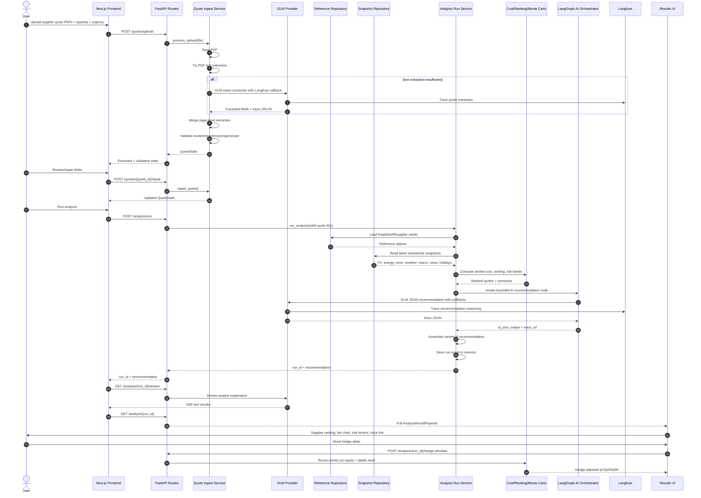
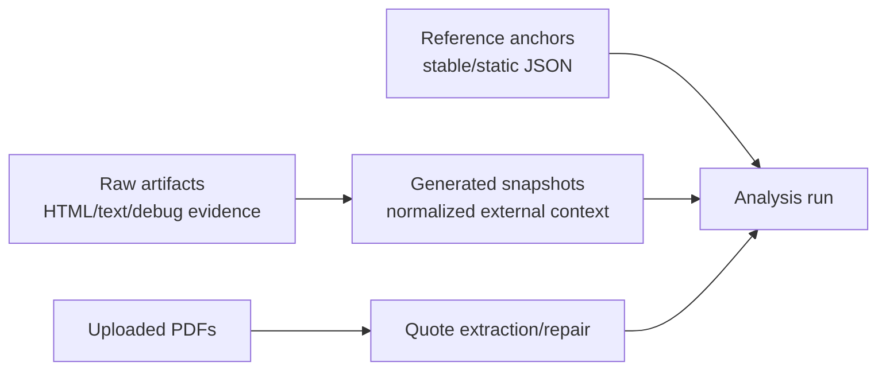

# LintasNiaga Full Repo Architecture Review & Diagram Blueprint

**Repository reviewed:** `JingXiang-17/404NotFounders`  
**Review date:** 2026-04-25  
**Purpose:** Describe the actual architecture from code + docs, not from Markdown files alone.  
**Output type:** Architecture explanation, coded architecture diagrams, Markdown-document scrutiny, and image-generation prompt.

---

## 0. Review Method and Current Grounding

This review was grounded against the current local working tree, not against Markdown files alone and not against an older GitHub-only snapshot.

I inspected current implementation files directly, then reconciled them against the project documentation.

I inspected:

- backend app startup and route registration
- quote upload/extraction/validation flow
- analysis orchestration flow
- active simulation services and helper Monte Carlo services
- AI / LangGraph / Langfuse integration
- snapshot repositories and external-provider boundaries
- frontend pages, API client, result components, and type contracts
- current Markdown architecture and QA documents
- backend test results and frontend production build result

### Verification basis

This document reflects the repo state verified on 2026-04-25, including:

- `py -m pytest -q apps/api/tests` -> `54 passed`
- `npm run build` in `apps/web` -> success
- current local code wiring for analysis, traceability, scheduled ingestion, and results UI

---

# 1. Executive Architecture Summary

LintasNiaga is currently best understood as a:

> **FastAPI-owned procurement decision system with a Next.js frontend, file-backed reference/snapshot data, in-memory active run state, deterministic landed-cost computation, snapshot-driven risk context, and bounded GLM reasoning with Langfuse traceability.**

The product is not just a chatbot and not just a dashboard.

The actual system combines:

1. **Quote intake**
   - PDF upload
   - deterministic text extraction first
   - GLM vision fallback
   - user repair
   - validation

2. **Reference and snapshot data layer**
   - static reference anchors under `data/reference`
   - normalized snapshots under `data/snapshots`
   - raw artifacts under `data/raw`
   - upload files under backend upload folder

3. **Backend deterministic analysis**
   - quote validation
   - supplier/freight/tariff matching
   - landed-cost calculation
   - ranking
   - risk-driver breakdown
   - Monte Carlo fan chart
   - hedge replay

4. **AI layer**
   - thin LangGraph graph
   - one recommendation reasoning node
   - GLM provider wrapper
   - Langfuse callbacks/traces
   - bounded JSON recommendation output

5. **Frontend decision workspace**
   - upload page
   - review/repair page
   - analysis progress page with SSE
   - results dashboard
   - fan chart
   - risk drivers
   - supplier cards
   - hedge slider
   - bank-instruction PDF generation
   - Langfuse trace link

---

# 2. Repository Structure as Architecture

```text
404NotFounders/
  apps/
    web/
      src/
        app/
          page.tsx
          analysis/
            new/page.tsx
            new/review/page.tsx
            [id]/page.tsx
            [id]/results/page.tsx
            [id]/results/components/
        components/
        lib/
          api.ts
          types.ts

    api/
      app/
        main.py
        api/routes/
        core/
        providers/
        repositories/
        schemas/
        scrapers/
        services/
      tests/

  data/
    reference/
    snapshots/
    raw/

  scripts/
    ingest_*.py

  tests/
    test_*.py

  *.md
  .agent/
  .antigravity/
```

## Architectural meaning

| Folder | Architectural role |
|---|---|
| `apps/web` | Thin client and decision workspace UI |
| `apps/api` | Main application authority and business logic owner |
| `apps/api/app/api/routes` | HTTP API surface |
| `apps/api/app/services` | Domain logic, orchestration, ingestion, simulation |
| `apps/api/app/providers` | External service adapters: GLM, yfinance, OpenWeather, OpenDOSM, GNews, SunSirs |
| `apps/api/app/repositories` | Local data access: reference JSON, snapshots, raw artifacts |
| `apps/api/app/schemas` | Pydantic request/response/domain contracts |
| `apps/api/app/scrapers` | Curated resin parsing and source registry logic |
| `data/reference` | Static deterministic anchors |
| `data/snapshots` | Generated normalized external context |
| `data/raw` | Raw evidence/debug artifacts |
| `scripts` | Manual/CLI ingestion entrypoints |
| `tests` and `apps/api/tests` | Backend and pipeline testing |

---

# 3. Coded Architecture Diagram

```mermaid
flowchart TB
  %% ======================
  %% User + Frontend
  %% ======================
  User["User: Malaysian SME procurement user"]

  subgraph WEB["apps/web - Next.js Frontend"]
    Landing["Landing Page\n/"]
    Upload["Upload + Request Setup\n/analysis/new"]
    Review["Review + Repair\n/analysis/new/review"]
    Progress["Analysis Progress + SSE\n/analysis/[id]"]
    Results["Decision Workspace\n/analysis/[id]/results"]
    UIComponents["Result Components\nsupplier cards, fan chart,\nhedge slider,\ncompact risk drivers,\nAI analyst panel,\nForwardContractPDF"]
    ApiClient["fetchApi()\nNEXT_PUBLIC_API_BASE_URL"]
    Types["TypeScript API Types\nsrc/lib/types.ts"]
  end

  User --> Landing
  Landing --> Upload
  Upload --> Review
  Review --> Progress
  Progress --> Results
  Results --> UIComponents
  WEB --> ApiClient

  %% ======================
  %% API Routes
  %% ======================
  subgraph API["apps/api — FastAPI Backend"]
    Main["main.py\nFastAPI app + CORS + lifespan refresh loops"]

    subgraph Routes["api/routes"]
      Health["health.py\n/health\n/health/langfuse\n/health/ingestion"]
      QuoteRoutes["quote_upload.py\nPOST /quotes/upload\nGET /quotes/{id}\nPOST /quotes/{id}/repair"]
      AnalysisRoutes["analysis.py\nPOST /analysis/run\nGET /analysis/{run_id}\nGET /analysis/{run_id}/stream\nGET /analysis/{run_id}/traceability\nPOST /analysis/{run_id}/hedge-simulate\nPOST /analysis/{run_id}/bank-instruction-draft"]
      SnapshotRoutes["snapshots.py\nGET /snapshots/latest/fx\nGET /snapshots/latest/news\nGET /snapshots/latest/weather\nGET /snapshots/latest/resin\nGET /snapshots/latest/macro"]
      IngestRoutes["ingest_* routes\nmarket/reference/holidays/macro/news/resin/weather"]
    end

    Main --> Routes
  end

  ApiClient --> QuoteRoutes
  ApiClient --> AnalysisRoutes
  ApiClient --> SnapshotRoutes
  ApiClient --> Health
  ApiClient --> IngestRoutes

  Progress -. "EventSource SSE" .-> AnalysisRoutes

  %% ======================
  %% Backend Services
  %% ======================
  subgraph Services["Backend Services"]
    QuoteIngest["quote_ingest_service.py\nPDF save, text extraction,\nGLM vision fallback,\nmerge, validate,\nin-memory QuoteState"]
    QuoteValidation["quote_validation_service.py\nFOB + currency + origin scope gate"]
    AnalysisRun["analysis_run_service.py\nMain analysis orchestrator\nin-memory run state"]
    CostEngine["cost_engine_service.py\nmaterial, freight,\ntariff, MOQ, trust penalty"]
    Ranking["recommendation_engine_service.py\nrank quotes"]
    MonteCarlo["landed_cost_monte_carlo_service.py\nrisk-driver scoring,\nhelper Monte Carlo,\nbank-draft support"]
    FxSimulation["fx_simulation_service.py\nactive quote fan chart\nFX + Brent simulation\nhedge replay inputs"]
    FxService["fx_service.py\nFX path summaries/fallbacks"]
    ContextBuilder["context_builder_service.py\nstructured AI context"]
    AIOrchestrator["ai_orchestrator_service.py\nthin LangGraph node\nbounded JSON reasoning\nSSE analyst explanation"]
    RecommendationAssembler["recommendation_assembler_service.py\nguardrail top-2 AI pick,\nfinal recommendation card"]
    ResinService["resin_benchmark_service.py\nSunSirs benchmark,\nmarket price risk,\nresin scenario context"]
    MarketService["market_data_service.py\nFX + energy snapshots"]
    WeatherService["weather_risk_service.py\nport weather risk"]
    HolidayService["holiday_service.py\nholiday snapshots"]
    MacroService["macro_data_service.py\nOpenDOSM macro context"]
    NewsService["news_event_service.py\nGNews event context"]
  end

  QuoteRoutes --> QuoteIngest
  QuoteIngest --> QuoteValidation
  AnalysisRoutes --> AnalysisRun
  AnalysisRun --> CostEngine
  AnalysisRun --> Ranking
  AnalysisRun --> MonteCarlo
  AnalysisRun --> FxSimulation
  AnalysisRun --> FxService
  AnalysisRun --> ContextBuilder
  AnalysisRun --> AIOrchestrator
  AnalysisRun --> RecommendationAssembler
  AnalysisRun --> ResinService
  AnalysisRun --> WeatherService
  AnalysisRun --> HolidayService
  AnalysisRun --> MacroService
  AnalysisRun --> NewsService

  %% ======================
  %% Providers
  %% ======================
  subgraph Providers["Provider Adapters"]
    GLMProvider["llm_provider.py\nChatOpenAI-compatible GLM\nLangfuse callbacks"]
    YFinance["yfinance_provider.py\nFX + Brent"]
    OpenWeather["openweather_provider.py\nweather forecast"]
    OpenDOSM["opendosm_provider.py\nIPI + trade data"]
    GNews["gnews_provider.py\nnews/event intake"]
    SunSirs["sunsirs_provider.py\nPP resin benchmark HTML"]
    HolidaysProvider["holiday_provider.py\npython-holidays"]
  end

  AIOrchestrator --> GLMProvider
  QuoteIngest --> GLMProvider
  MarketService --> YFinance
  WeatherService --> OpenWeather
  MacroService --> OpenDOSM
  NewsService --> GNews
  ResinService --> SunSirs
  HolidayService --> HolidaysProvider

  %% ======================
  %% External Systems
  %% ======================
  subgraph External["External Systems"]
    GLM["GLM / ilmu-compatible model endpoint"]
    Langfuse["Langfuse\nAI trace dashboard"]
    Yahoo["Yahoo/yfinance market data"]
    OW["OpenWeather API"]
    DOSM["OpenDOSM / data.gov.my"]
    GNewsAPI["GNews / RSS-backed news"]
    SunSirsSite["SunSirs PP pages"]
  end

  GLMProvider --> GLM
  GLMProvider --> Langfuse
  MonteCarlo -. "optional Langfuse span in parallel simulator" .-> Langfuse
  YFinance --> Yahoo
  OpenWeather --> OW
  OpenDOSM --> DOSM
  GNews --> GNewsAPI
  SunSirs --> SunSirsSite

  %% ======================
  %% Data Layer
  %% ======================
  subgraph Data["Local Data Layer"]
    Reference["data/reference\nfreight_rates.json\ntariffs_my_hs.json\nports.json\nsupplier_seeds.json"]
    Snapshots["data/snapshots\nfx/*\nenergy/BZ=F\nweather\nmacro\nmacro_trade\nnews\nresin\nholidays"]
    Raw["data/raw\nresin_html\nresin_text\nsource artifacts"]
    Uploads["apps/api/uploads or UPLOAD_DIR\nuploaded PDFs"]
    Memory["In-memory runtime state\nQUOTE_STATES\n_run_contexts\n_run_results\n_run_monte_carlo_inputs"]
  end

  subgraph Repositories["Repository Layer"]
    ReferenceRepo["reference_repository.py"]
    SnapshotRepo["snapshot_repository.py"]
    RawRepo["raw_repository.py"]
  end

  QuoteIngest --> Uploads
  QuoteIngest --> Memory
  AnalysisRun --> Memory

  ReferenceRepo --> Reference
  SnapshotRepo --> Snapshots
  RawRepo --> Raw

  AnalysisRun --> ReferenceRepo
  AnalysisRun --> SnapshotRepo
  ResinService --> SnapshotRepo
  ResinService --> RawRepo
  MarketService --> SnapshotRepo
  WeatherService --> SnapshotRepo
  MacroService --> SnapshotRepo
  NewsService --> SnapshotRepo
  HolidayService --> SnapshotRepo

  SnapshotRoutes --> SnapshotRepo
  Health --> SnapshotRepo
  Health --> ReferenceRepo
```



---

# 4. Coded Runtime Sequence Diagram



---

# 5. Frontend Architecture

## 5.1 Frontend role

The frontend is correctly implemented as a **thin workflow shell**, not the owner of procurement math.

It owns:

- user navigation
- upload UX
- review/edit forms
- calling backend endpoints
- streaming analyst text
- rendering the final decision workspace
- PDF rendering for the bank instruction draft

It does **not** own:

- quote validation truth
- landed-cost formula
- ranking
- simulation
- hedge replay math
- AI recommendation assembly
- external data access

## 5.2 Main frontend pages

| Page | File | Role |
|---|---|---|
| Landing | `apps/web/src/app/page.tsx` | Explains workflow and routes to new analysis |
| Upload/setup | `apps/web/src/app/analysis/new/page.tsx` | Upload PDFs, quantity, urgency |
| Review/repair | `apps/web/src/app/analysis/new/review/page.tsx` | Fetch quote states, edit fields, repair, trigger analysis |
| Progress | `apps/web/src/app/analysis/[id]/page.tsx` | Poll result + consume SSE analyst stream |
| Results | `apps/web/src/app/analysis/[id]/results/page.tsx` | Decision workspace, fan chart, supplier cards, risk drivers, hedge slider, bank PDF |

## 5.3 Frontend data access

`apps/web/src/lib/api.ts` centralizes API calls through:

```ts
NEXT_PUBLIC_API_BASE_URL || "http://localhost:8000"
```

It sets JSON headers automatically unless the request body is `FormData`.

## 5.4 Frontend result components

| Component | Role |
|---|---|
| `SupplierCard.tsx` | Recommended/non-winning supplier display |
| `FxFanChart.tsx` | p10/p50/p90 landed-cost scenario visualization with dynamic horizon labels |
| `HedgeSlider.tsx` | User-driven hedge replay |
| `RiskDriversPanel` in `results/page.tsx` | Compact judge-friendly risk bullets with severity badge, evidence, impact, and optional source link |
| `ReasoningPanel.tsx` | AI recommendation reasons + Langfuse trace link |
| `ForwardContractPDF.tsx` | Client-side bank instruction PDF rendering |

---

# 6. Backend Architecture

## 6.1 Backend role

FastAPI is the system authority.

It owns:

- route contracts
- upload handling
- scope validation
- reference loading
- snapshot reading/writing
- external provider orchestration
- deterministic landed-cost math
- risk simulation
- AI context construction
- bounded AI invocation
- final recommendation assembly
- in-memory run state
- hedge replay
- bank instruction draft generation

## 6.2 FastAPI startup behavior

`main.py` starts a FastAPI app and registers route groups for:

- health
- ingestion
- snapshots
- quotes
- analysis

It also starts background refresh loops for:

- hourly news
- daily holidays
- daily SunSirs resin
- daily FX and Brent energy
- six-hour weather
- daily OpenDOSM macro

This is more active than some older docs imply. The app is not merely passively reading pre-existing snapshots; it can refresh them during runtime.

---

# 7. Quote Intake Architecture

## 7.1 Actual flow

1. User uploads a PDF to `/quotes/upload`.
2. Backend saves the PDF to local upload storage.
3. Backend attempts PDF text extraction using PyMuPDF.
4. If deterministic extraction is insufficient or invalid, backend renders the first two pages to PNG.
5. GLM vision extraction runs through `GLMProvider`.
6. Page-level extraction results are merged.
7. `quote_validation_service.py` validates the merged quote.
8. The final `QuoteState` is stored in memory.

## 7.2 Validation scope

A quote is valid only if it fits the current product wedge:

- incoterm must be FOB
- currency must be USD, CNY, THB, or IDR
- origin must be recognized as China, Thailand, or Indonesia
- required fields must exist:
  - supplier
  - unit price
  - MOQ
  - lead time
  - incoterm
  - currency
  - origin

## 7.3 Current runtime storage

Quote state lives in:

```text
QUOTE_STATES: dict[UUID, QuoteState]
```

This means active quote states are lost on backend restart.

---

# 8. Reference, Snapshot, and Raw Data Architecture

## 8.1 Three data classes



## 8.2 Reference anchors

Stored under:

```text
data/reference/
```

Used for deterministic assumptions:

- freight baselines
- tariff rules
- ports
- supplier seed reliability

Accessed through:

```text
reference_repository.py
reference_data_service.py
```

## 8.3 Snapshots

Stored under:

```text
data/snapshots/
```

Used for external context:

- `fx/{PAIR}`
- `energy/BZ=F`
- `weather`
- `macro`
- `macro_trade`
- `news`
- `resin`
- `holidays`

Accessed through:

```text
snapshot_repository.py
```

## 8.4 Raw artifacts

Stored under:

```text
data/raw/
```

Important especially for resin ingestion:

- raw SunSirs HTML
- cleaned text
- source artifacts for debugging

Accessed through:

```text
raw_repository.py
```

---

# 9. Ingestion Architecture

## 9.1 Provider → service → repository pattern

The intended and mostly implemented pattern is:

```text
Provider fetches source data
        ↓
Service normalizes / validates / derives context
        ↓
Repository writes snapshot or raw artifact
        ↓
Analysis consumes latest normalized snapshot
```

## 9.2 External data map

| Dataset | Provider | Service | Snapshot role |
|---|---|---|---|
| FX | `yfinance_provider.py` | `market_data_service.py`, `fx_service.py` | currency conversion and simulation |
| Brent energy | `yfinance_provider.py` | `market_data_service.py` | freight/oil risk context |
| Weather | `openweather_provider.py` | `weather_risk_service.py` | port disruption risk |
| Holidays | `holiday_provider.py` | `holiday_service.py` | delay/closure context |
| Macro | `opendosm_provider.py` | `macro_data_service.py` | Malaysia macro context |
| News | `gnews_provider.py` | `news_event_service.py` | event/risk context |
| PP resin | `sunsirs_provider.py` + parser | `resin_benchmark_service.py` | quote-vs-market benchmark |

---

# 10. Analysis Architecture

## 10.1 Main analysis run

The main analysis entrypoint is:

```text
POST /analysis/run
```

The backend sequence is:

1. collect valid quote IDs
2. load quote states from memory
3. load reference data
4. build FX simulations/fallbacks
5. match supplier seed
6. match freight rate
7. match tariff rule
8. compute landed costs
9. rank quotes
10. load macro/news/resin/weather/holiday context
11. build risk driver breakdown
12. build landed-cost scenarios
13. build AI context
14. run bounded GLM reasoning through LangGraph
15. assemble final recommendation
16. store result in memory
17. return `run_id` and recommendation

## 10.2 Deterministic landed-cost formula

Implemented cost components:

- material cost
- freight cost
- import tariff
- MOQ penalty
- supplier trust penalty
- total landed p10/p50/p90

Important detail:

- tariff is applied to material cost p50
- freight is converted using current FX
- non-`mt` freight unit currently uses a rough `quantity_mt / 20` conversion

## 10.3 Monte Carlo / fan chart

The active quote-scenario path now uses:

```text
fx_simulation_service.py
```

through:

```text
simulate_landed_cost()
```

inside `analysis_run_service.py`.

It produces the active quote fan chart and delivery distribution:

- p10 envelope
- p50 envelope
- p90 envelope
- delivery distribution
- hedge-adjusted replay using stable seeded shocks

Its main stochastic drivers are:

- quote FX movement
- USDMYR freight conversion movement
- Brent oil movement

Its deterministic add-ons include:

- tariff
- MOQ penalty
- supplier trust penalty
- delay-window expansion from weather and holidays

## 10.4 Helper Monte Carlo note

The repo still also uses:

```text
landed_cost_monte_carlo_service.py
```

This service is not dead code, but it is no longer the sole active fan-chart engine. In the current runtime it remains involved for supporting calculations such as:

- risk-driver breakdown support
- deterministic risk summaries
- hedge/bank-instruction helper flows

So the current architecture is hybrid:

- `fx_simulation_service.py` is the active quote-level fan-chart simulator
- `LandedCostMonteCarloService` remains a supporting analysis service

---

# 11. AI and Langfuse Architecture

## 11.1 AI roles

AI is used for:

- quote extraction fallback
- recommendation reasoning
- streamed analyst explanation
- bank instruction wording

AI is **not** the owner of:

- validation rules
- landed-cost math
- ranking
- tariff/freight formula
- hedge replay math

## 11.2 LangGraph role

`ai_orchestrator_service.py` defines a thin LangGraph workflow.

Current graph shape:

```text
reason_recommendation node → END
```

That node:

1. receives structured context
2. sends system + human messages to GLM
3. requires JSON output
4. parses JSON
5. captures `trace_url`
6. returns AI JSON into graph state

## 11.3 Langfuse role

Langfuse is used as the AI traceability layer.

The frontend displays the trace through:

```text
ReasoningPanel.tsx → View Langfuse Trace
```

The backend exposes Langfuse health through:

```text
GET /health/langfuse
```

The backend also exposes run-level traceability through:

```text
GET /analysis/{run_id}/traceability
```

and the current result payload includes:

- `trace_url`
- `stream_trace_url`

## 11.4 Current Langfuse hardening

The latest `llm_provider.py` makes Langfuse tracing stricter than earlier versions:

- `langfuse` import failure raises an error
- `_callbacks()` requires Langfuse credentials
- extraction can return trace URL and trace ID
- recommendation reasoning uses trace callbacks
- `langfuse_status()` exposes health details

This is good for judge-proof tracing, but increases local/demo fragility if Langfuse is not configured correctly.

---

# 12. Recommendation Assembly and Guardrails

The final recommendation is not simply whatever the model says.

`recommendation_assembler_service.py` applies guardrails:

- deterministic winner is default
- model can only choose rank #1 or rank #2
- invalid/hallucinated model quote ID falls back to deterministic winner
- single quote mode gets honest labels:
  - `proceed`
  - `review_carefully`
  - `do_not_recommend`
- comparison mode gets backup options and why-not reasoning

This is architecturally important because it keeps AI bounded.

---

# 13. Frontend-to-Backend Contract

## 13.1 Main endpoints used by frontend

| Frontend action | Backend endpoint |
|---|---|
| Upload quote | `POST /quotes/upload` |
| Fetch quote | `GET /quotes/{quote_id}` |
| Repair quote | `POST /quotes/{quote_id}/repair` |
| Fetch latest FX | `GET /snapshots/latest/fx` |
| Run analysis | `POST /analysis/run` |
| Stream analyst text | `GET /analysis/{run_id}/stream` |
| Fetch result | `GET /analysis/{run_id}` |
| Fetch traceability | `GET /analysis/{run_id}/traceability` |
| Hedge replay | `POST /analysis/{run_id}/hedge-simulate` |
| Bank instruction | `POST /analysis/{run_id}/bank-instruction-draft` |
| Fetch latest news/weather | `GET /snapshots/latest/news`, `GET /snapshots/latest/weather` |

## 13.2 Contract status

This contract area has been reconciled in the current repo state.

The backend schema and frontend types now both expose:

- `top_news_events`
- `trace_url`
- `stream_trace_url`
- `market_price_risks`
- `resin_price_scenario`
- `risk_driver_breakdown`

The current results page reads `analysis.top_news_events` legitimately and no longer depends on an undocumented field.

---

# 14. Markdown File Review Matrix

| Markdown file | Role | Current accuracy | Notes |
|---|---|---:|---|
| `README.md` | High-level overview | Partly stale | Mentions Supabase and Upstash as architecture pieces, but active runtime is file-backed/in-memory. Also references `LintasNiaga_WINNING_PLAYBOOK.md`, which was not surfaced in MD search. |
| `PRD.md` | Submission PRD | Mostly current | Good concise product description. Correctly frames PP resin procurement, deterministic + AI, and in-memory constraints. |
| `DESIGN.md` | Design system | Current for UI direction | Matches dark institutional UI implemented in frontend. |
| `SAD.md` | System analysis | Mostly current | Traceability route exists in current backend, so older mismatch concerns are resolved. |
| `QATD.md` | QA document | Useful but stale on counts | Current repo verification is `54 passed`; the doc still says `42 passed`. |
| `progress_tracker.md` | Handoff status | Stale | It still reflects an older build stage and says `18 passed`; current repo state is materially ahead of that note. |
| `LintasNiaga_Comprehensive_PRD_v2_1_IngestionLocked.md` | Detailed PRD | Mostly current | `stream_trace_url` is now present in current backend schema, so this is no longer ahead of code on that point. |
| `LintasNiaga_Tech_Stack_Blueprint_v2_1_IngestionAligned.md` | Stack blueprint | Good strategic source | Some parts are aspirational or older, especially SQLite and hosted persistence. |
| `LintasNiaga_Architecture_Blueprint_v2_1_IngestionAligned.md` | Architecture blueprint | Mostly current after recent fixes | The repo now does use `fx_simulation_service.py` in active analysis, while `LandedCostMonteCarloService` remains a supporting service. |
| `apps/web/README.md` | Default Next.js README | Not architecture-specific | Can be replaced with project-specific frontend instructions. |
| `apps/web/AGENTS.md` | Agent instruction | Current enough | Tells agents to check current Next docs. |
| `apps/web/CLAUDE.md` | Agent alias | Minimal | Points to AGENTS.md. |
| `.antigravity/rules.md` | Build constraints | Useful but partly stale | Analysis itself stays snapshot-based, but the backend now also runs scheduled refresh loops for keeping snapshots fresh. |
| `.agent/workflows/run-frontend-build.md` | Build workflow | Simple/current | `cd apps/web`, `pnpm build`. |
| `.agent/workflows/run-backend-tests.md` | Backend test workflow | Simple/current-ish | Assumes venv activation path; may differ on Windows. |
| `.agent/workflows/create-snapshot-service.md` | Ingestion service pattern | Current | Matches provider/service/route/schema/test pattern. |
| `.agent/workflows/validate-snapshot-envelope.md` | Snapshot validation pattern | Current | Matches common envelope contract. |
| `.agent/skills/langgraph-integration/SKILL.md` | AI orchestration guidance | Mostly current | Correctly insists LangGraph stays thin and deterministic math stays outside graph. |

---

# 15. Key Architecture Risks That Still Remain

The earlier route/schema/simulator mismatches have been resolved in the current repo state. The remaining architecture risks are the ones below.

## 15.1 In-memory active state

Current runtime state includes:

- `QUOTE_STATES`
- `_run_contexts`
- `_run_results`
- `_run_monte_carlo_inputs`

This means a server restart loses active user runs.

## 15.2 Settings split

The repo has both:

- `core/config.py`
- `core/settings.py`

This works but creates duplicated configuration paths.

## 15.3 Unreachable Langfuse validation code

`AppSettings.from_env()` returns the dataclass instance before calling `validate_langfuse()`, making the validation call unreachable in the current file.

Langfuse is still validated through `GLMProvider._callbacks()`, but the settings-level validation appears dead.

## 15.4 Freight unit conversion risk

For non-`mt` freight units, the cost engine uses:

```text
rate_value * (quantity_mt / 20.0)
```

This encodes a 20MT container assumption implicitly. It should be explicit in schema, source note, and UI wording.

## 15.5 Background refresh load

`main.py` starts several background loops automatically. This makes data fresher but can add startup/runtime fragility during demo/deployment.

## 15.6 QA count conflict

`QATD.md` says 42 backend tests passed.

`progress_tracker.md` says 18 passed in a separate verification.

The current repo verification is `54 passed`, so both documents should be reconciled before submission.

---

# 16. Final Architecture Description

## 16.1 One-sentence architecture

> LintasNiaga is a FastAPI-centered procurement decision engine where Next.js handles the workflow UI, local reference/snapshot files provide deterministic and market context, backend services compute landed-cost risk and recommendations, and a bounded GLM/LangGraph layer adds traceable reasoning without owning the core math.

## 16.2 More detailed architecture

LintasNiaga starts with uploaded supplier quote PDFs. The frontend sends these to FastAPI, which stores the files, extracts quote fields through deterministic PDF text parsing first, falls back to GLM vision extraction when necessary, validates scope, and stores the quote state in memory.

The user reviews and repairs extracted fields in the frontend. When analysis starts, FastAPI loads reference anchors such as freight rates, tariff rules, and supplier seed reliability. It also reads normalized snapshots for FX, energy, weather, holidays, macro data, news, and PP resin benchmarks. These snapshots are generated through provider-specific ingestion services, refreshed by background loops while the backend is running, and saved under the local `data/snapshots` layer.

The deterministic backend computes material cost, freight, tariff, MOQ penalty, supplier trust penalty, and ranked quote results. The active quote fan chart now comes from the snapshot-only `fx_simulation_service.py`, which simulates quote FX, freight FX, and Brent-linked freight pressure with stable seeded paths. PP resin benchmark data from SunSirs is used to classify supplier quotes as below-market, fair, premium, or high-premium, but it is not currently a direct stochastic material-price path driver.

After deterministic ranking and scenario generation, the backend builds structured AI context and invokes a thin LangGraph reasoning node. The GLM returns bounded JSON containing supplier, timing, hedge, reasons, caveat, and backup rationale. The recommendation assembler enforces guardrails, including falling back to the deterministic winner if the model picks an invalid supplier.

The final result is stored in memory and rendered by the frontend results page. Users can inspect supplier cards, fan chart risk bands, compact evidence-based risk driver bullets, AI analyst reasoning, and a Langfuse trace link. Users can also adjust the hedge slider, which calls a backend endpoint to recalculate risk exposure, and generate a bank-instruction PDF through a backend draft plus frontend PDF renderer.

---

# 17. Recommended Fixes Before Demo / Submission

## Must fix

1. Reconcile QA count.
   - Pick one latest test run and update `QATD.md` + `progress_tracker.md`.
   - Current verified baseline for this review is `54 passed`.

## Strongly recommended

2. Clean up the settings split and dead Langfuse validation path.
   - `core/config.py` and `core/settings.py` should be rationalized.
   - `AppSettings.validate_langfuse()` should either run or be removed.

3. Make freight unit semantics explicit:
   - `mt`
   - `container_20ft`
   - `shipment_total`

   Avoid silent `quantity/20` conversion for unknown units.

4. Convert run state from memory to SQLite/Supabase if time permits.
   - If not, document it as hackathon-local limitation.

5. Replace `apps/web/README.md` with project-specific frontend setup.

6. Update README to remove or clearly label Supabase/Upstash as roadmap.

7. Clarify startup refresh policy:
   - scheduled refresh
   - ensure-fresh before analysis
   - demo/frozen mode

---

# 18. Prompt for GPT / Gemini to Generate an Image Architecture Diagram

Use this prompt to generate a polished visual architecture diagram:

```text
Create a clean, professional software architecture diagram for a hackathon product called "LintasNiaga".

The product is a Malaysian SME procurement decision copilot for PP resin imports. It compares supplier quotation PDFs, computes landed cost, simulates risk bands, recommends supplier/timing/hedge ratio, and shows traceable AI reasoning.

Use a modern technical architecture style: dark background, teal accents, clean boxes, readable labels, arrows showing data flow. Make it suitable for a pitch deck or technical appendix. Avoid tiny text. Use 4 main horizontal layers.

Layer 1: User + Next.js Frontend
- User
- Landing page
- Upload/setup page
- Review/repair page
- Analysis progress page with SSE stream
- Results dashboard
- Components: Supplier Cards, Fan Chart, Hedge Slider, compact Risk Drivers, AI Analyst Panel, Bank Instruction PDF
- API client using NEXT_PUBLIC_API_BASE_URL

Layer 2: FastAPI Backend Routes
- /quotes/upload
- /quotes/{quote_id}
- /quotes/{quote_id}/repair
- /analysis/run
- /analysis/{run_id}
- /analysis/{run_id}/stream
- /analysis/{run_id}/traceability
- /analysis/{run_id}/hedge-simulate
- /analysis/{run_id}/bank-instruction-draft
- /snapshots/latest/*
- /ingest/*
- /health and /health/ingestion and /health/langfuse

Layer 3: Backend Services and Logic
- Quote Ingest Service: PDF save, deterministic text extraction, GLM vision fallback
- Quote Validation Service: FOB, currency, origin, required fields
- Analysis Run Service: main orchestrator
- Reference Data Service
- Cost Engine: material, freight, tariff, MOQ, trust penalty
- Ranking Service
- Landed Cost Monte Carlo Service: p10/p50/p90 fan chart, hedge replay
- Resin Benchmark Service: SunSirs benchmark and quote-vs-market risk
- Weather, Holiday, Macro, News, Market Data services
- Context Builder
- Thin LangGraph AI Orchestrator
- Recommendation Assembler with guardrails

Layer 4: Data, Providers, and Observability
- Local data/reference: freight_rates.json, tariffs_my_hs.json, ports.json, supplier_seeds.json
- Local data/snapshots: FX, energy, weather, macro, news, resin, holidays
- Local data/raw: SunSirs raw HTML and extracted text
- Uploaded PDFs
- In-memory runtime state: QUOTE_STATES, run contexts, run results
- External providers: GLM/OpenAI-compatible model, Langfuse, yfinance, OpenWeather, OpenDOSM/data.gov.my, GNews, SunSirs
- Langfuse should be shown connected to GLM calls and the AI Analyst trace link

Show the main runtime flow with arrows:
User uploads PDFs -> Next.js -> FastAPI quote upload -> quote extraction/validation -> review/repair -> analysis run -> reference + snapshots -> deterministic cost/risk engine -> LangGraph/GLM reasoning -> recommendation result -> frontend results dashboard -> hedge replay and PDF generation.

Make clear that:
- Frontend is thin
- FastAPI owns business logic
- Deterministic math runs before AI reasoning
- External data is normalized into snapshots before analysis
- AI is bounded and traceable, not the source of raw math
- Active state is currently memory-backed while reference/snapshot/raw artifacts are file-backed

Do not draw Supabase, Redis, Celery, Docker, or GraphQL as active components. If you include them, label them strictly as roadmap/future only, not active.
```

---

# 19. Suggested Short Pitch Explanation of the Architecture

> LintasNiaga uses a thin Next.js frontend and a FastAPI backend that owns the full procurement decision workflow. Supplier quotes are uploaded as PDFs, extracted through deterministic parsing with GLM fallback, then validated for FOB PP resin import scope. The backend loads curated reference data and normalized market snapshots, computes landed-cost scenarios and p10/p50/p90 risk bands, then passes structured context into a thin LangGraph reasoning node. The GLM produces bounded recommendation JSON, while the backend assembler applies guardrails and returns the final supplier, timing, and hedge recommendation. Langfuse traces the AI calls for judge visibility, and the frontend renders the decision workspace with fan chart, risk drivers, supplier cards, hedge replay, and a bank-instruction PDF flow.

---

# 20. Final Judgment

The repo is much more than a static mockup.

It already contains:

- a real frontend workflow
- a working backend architecture
- quote extraction and repair logic
- reference and snapshot repositories
- multiple ingestion services
- deterministic landed-cost and ranking logic
- Monte Carlo fan chart logic
- bounded AI reasoning
- Langfuse traceability
- bank-instruction PDF generation
- backend tests

The main issue is not lack of architecture.

The main issue is still **architecture drift between docs and code** caused by rapid hackathon iteration, but several previously reported mismatches have now been resolved in code:

- `/analysis/{run_id}/traceability` exists
- `top_news_events` is in contract
- `stream_trace_url` is in contract
- `fx_simulation_service.py` is wired into active analysis
- the results page now uses compact evidence-based risk-driver bullets rather than the older long-card version

The most important next action is to align:

1. actual routes
2. actual result schema
3. actual simulator used
4. current test count
5. README/architecture docs
6. frontend type contract

Once those are aligned, the project has a coherent and defensible architecture story for judges.
