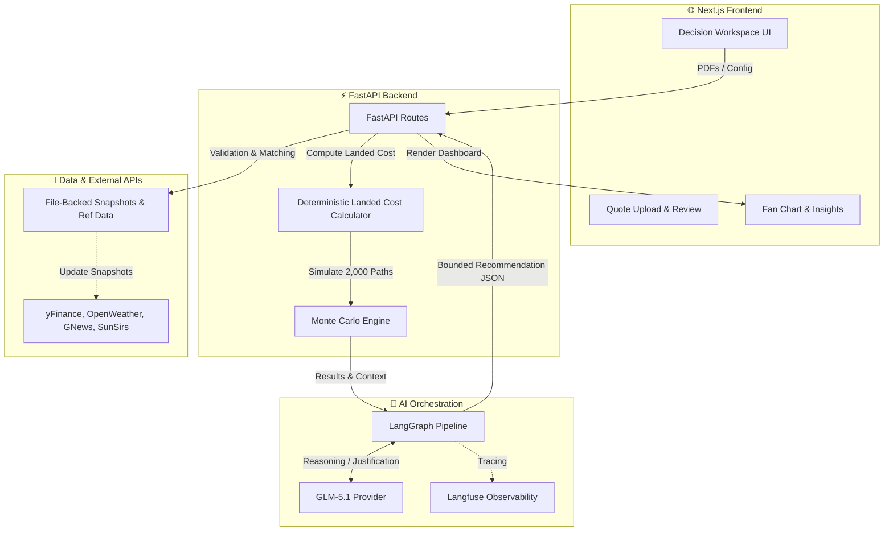

# 🌍 LintasNiaga 🚀

> **Choose the best-value supplier with less hidden risk.**

LintasNiaga is a procurement decision-support copilot built for Malaysian plastics SMEs that import polypropylene (PP) resin. It turns fragmented supplier PDF quotes and noisy market data into one clear, defensible procurement decision — complete with a supplier recommendation, timing stance, and FX hedge ratio.

---

## 🔗 Quick Links

| Document | Link |
|---|---|
| **📄 PRD (Product)** | [Link to PRD](#) |
| **⚙️ SAD (System)** | [Link to SAD](#) |
| **🧪 QATD (Testing)** | [Link to QATD](#) |
| **📊 Pitching Deck** | [Link to Pitch Deck](#) |
| **🎥 10 Minutes Pitching Video** | [Link to Video](#) |

---

## 👥 Team 404NotFounders

| Name | Role |
|---|---|
| [Name 1] | [Role 1] |
| [Name 2] | [Role 2] |
| [Name 3] | [Role 3] |
| [Name 4] | [Role 4] |

*(UMHackathon 2026, Domain 2)*

---

## 🔄 App Workflow

LintasNiaga walks the user through a focused four-stage workflow:

1. **📥 Upload:** Upload up to five supplier quote PDFs. The system extracts key fields using deterministic extraction with a GLM-5.1 vision fallback.
2. **🔍 Review and Repair:** Extracted fields are surfaced for review. Users can correct values, select order quantity, urgency level, and hedge preference (Balanced / Conservative / Aggressive).
3. **🧠 Analysis:** The backend refreshes live market and logistics context (FX rates, Brent crude, weather risk, macro indicators, news signals) then runs deterministic landed-cost calculations and a 30-day Monte Carlo fan chart, capped off by bounded AI reasoning.
4. **📊 Decision Result:** Receive a single, traceable recommendation:
   - Which supplier to choose (with ranked alternatives)
   - Whether to lock now or wait
   - How much FX exposure to hedge
   - A 30-day landed-cost fan chart with p10 / p50 / p90 bands
   - Downloadable bank-instruction PDF

---

## 🏗️ Architecture Diagram



---

## 🛠️ Setup Guide

### 1. Clone the repository
```bash
git clone https://github.com/JingXiang-17/404NotFounders.git
cd 404NotFounders
```

### 2. Backend Setup
```bash
cd apps/api
python -m venv .venv
source .venv/Scripts/activate  # On Windows
pip install -e .
cp .env.example .env           # Configure your API keys (e.g., ZHIPU_API_KEY)
uvicorn app.main:app --reload --port 8000
```

### 3. Frontend Setup
```bash
cd apps/web
pnpm install
pnpm dev
```

The application will be running at `http://localhost:3000`.

---

## 📁 Repository Structure

```text
404NotFounders/
├── apps/
│   ├── api/                 # FastAPI Backend
│   │   ├── app/             # Application Logic (Routes, Services, Providers)
│   │   ├── data/            # Local Reference & Snapshot Data
│   │   ├── scripts/         # Ingestion Scripts
│   │   └── tests/           # Pytest Test Suite
│   └── web/                 # Next.js Frontend
│       ├── src/app/         # Next.js App Router (Upload, Review, Analysis, Results)
│       ├── src/components/  # UI Components & Dashboard Widgets
│       └── src/lib/         # Frontend Utilities & Type Contracts
├── .agent/                  # AI Agent Skills & Workflows
├── example_pdf/             # Sample PDF Quotes for demonstration
├── tests/                   # E2E & Integration testing artifacts
├── Makefile                 # Development helper commands
└── README.md                # Project documentation
```
